<div align="center">
<h1>MERN Point Of Sale System</h1>
</div>
<div align="center">
  <h1>Authors</h1>
  <h2> Grace | Stefan | Heg </h2>
  <a href="https://www.linkedin.com/in/grace-narez-8b0498238/"_target="_blank">
  
  
  </a>
  <br>
  <a href="https://www.linkedin.com/in/stefan-vosloo/" target="_blank">
    
  </a>
  <br>
  <a href="https://www.linkedin.com/in/huseyingumus/" target="_blank">
    
  </a>
  </div>
  <br>

## Table of Contents

- [Project Description](#project-idea-and-description)
- [Installation Instructions](#installation-instructions)
- [Database Schema](#database-schema)
- [RESTful Routing Charts](#restful-routing-charts)
- [Wireframes](#wireframes)
- [User Stories](#user-stories)
- [Goals](#goals)
- [Tech Stacks](#tech-stacks)
- [Our Approach](#our-approach)
- [Authors](#authors)

## Project Idea and Description

Create a full-stack MERN application which allows business owners to store inventory and prices along with a second level of auth (cashier), both being able to complete customer transactions while the admin has ability to complete full CRUD on available schemas.

## Installation Instructions

1. Fork and clone repo
2. Run npm i to install all dependencies
3. set up JWT_SECRET in .env of server and REACT_APP_SERVER_URL in .env.local of client

## Database Schema

<details>
<summary>
==>
</summary>

```json
{
  "users": {
    "id": "ObjectId",
    "username": "String",
    "password": "String",
    "role": "String"
  },
  "categories": {
    "id": "ObjectId",
    "name": "String",
    "color": "String"
  },
  "products": {
    "id": "ObjectId",
    "code": "String",
    "name": "String",
    "price": "Number",
    "category": "ObjectId"
  },
  "orders": {
    "id": "ObjectId",
    "user": "ObjectId",
    "lineItems": [
      {
        "product": "ObjectId",
        "price": "Number",
        "quantity": "Number"
      }
    ],
    "cashier": "ObjectId",
    "payment_method": "String",
    "total": "Number"
  }
}
```

</details>

## RESTful Routing Charts

<details>
<summary>
==>
</summary>

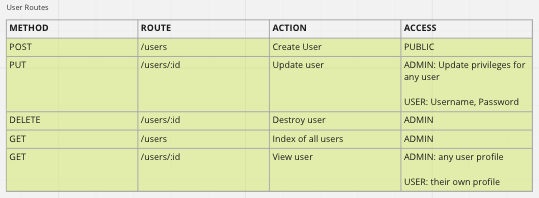
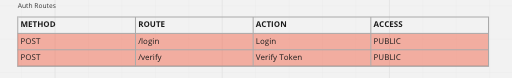
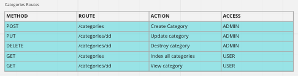
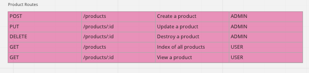
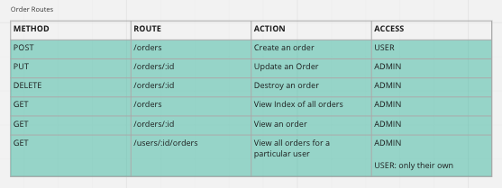

</details>

## Wireframes

<details>
<summary>
==>
</summary>

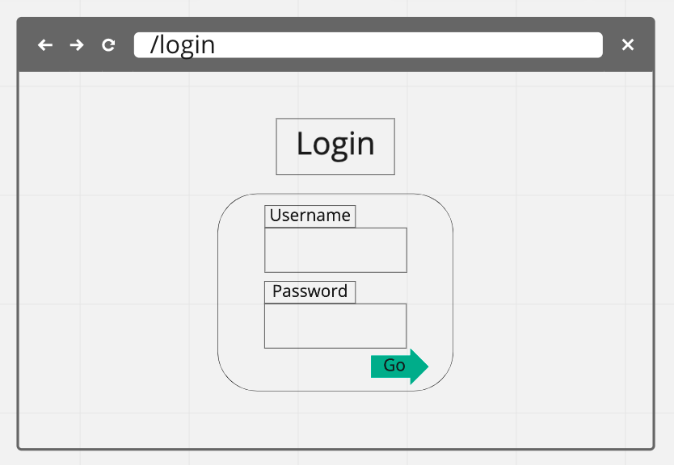
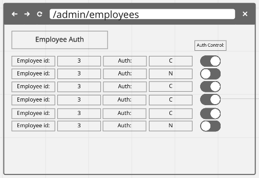
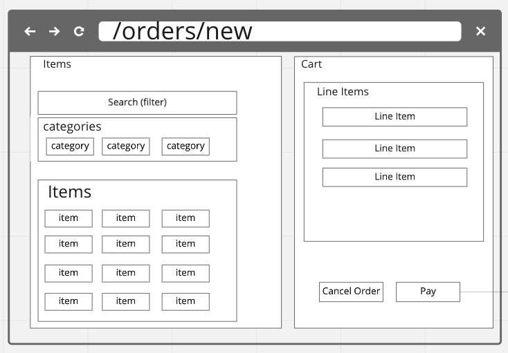
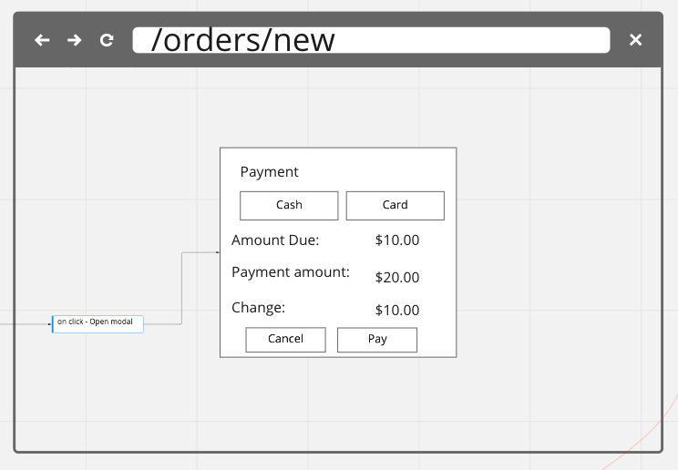
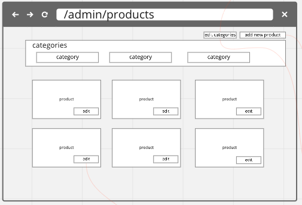
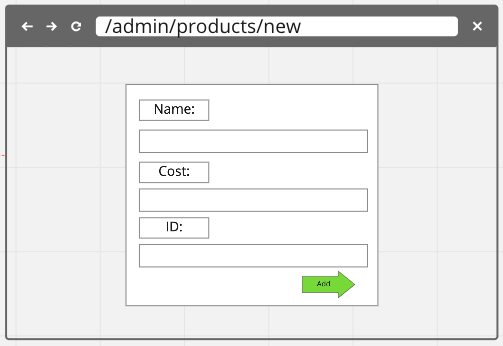
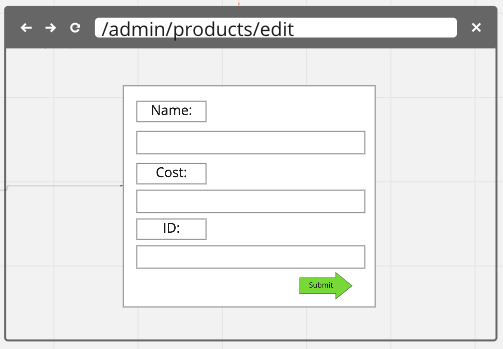
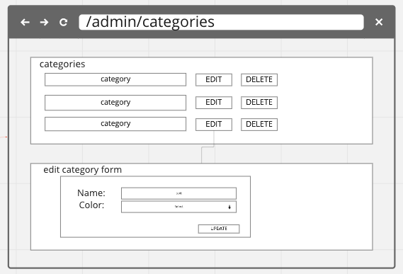
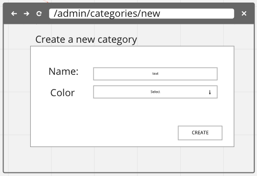
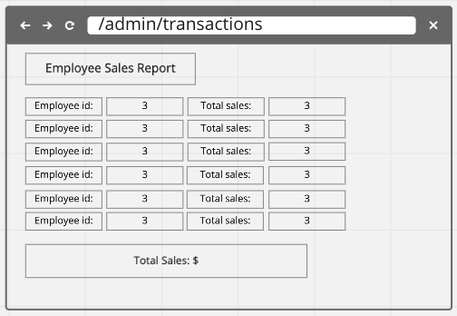
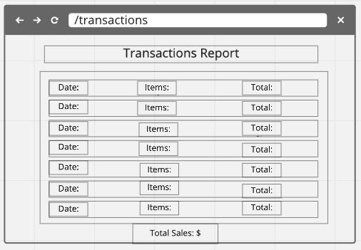

</details>

## User Stories

- [x] As a non-logged in user, I can access the login page and signup page, so that I can create an account or log in.
- [x] As a cashier, I want to be able to place orders.
- [x] As a cashier, I want to be taken to the new order page as soon as I log in.
- [x] As an admin, I want to be able to place orders, in case no other cashiers are available.
- [x] As an admin, I want to be able to view all products, and update or delete them.
- [x] As an admin, I want to be able to view all categories, and update or delete them.
- [x] As an admin, I want to be able to view all orders, and update or delete them.
- [x] As an admin, I want to be able to view all employees, and update or delete them.
- [x] As an admin, I want to be able to change employee privileges.
- [x] As an admin, I want to be able to give each category a color, so that I can easily identify them.
- [ ] As an admin, I want to be able set the color theme
- [ ] As a cashier, I want to be able to see a list of all my orders.
- [ ] As an admin, I want to be taken to the transactions page as soon as I log in, so that I can easily see an overview of the day's sales.

## Goals

### MVP

- Ability to either login or signup (only) if you are a non-logged in user
- Ability for "Cashiers" to complete transactions only
- On login (cashiers), direct to new order page
- On login (admin), direct to all products
- Admin ability to view ALL transactions
- Admin ability to complete full CRUD on schemas
- Admin ability to update user permissions
- Admin ability to checkout if needed

### Stretch Goals

- [x] Ability to sort transactions by date/employee/filter
- [ ] Ability for Cashiers to see own transaction history
- [ ] Admin ability to set color theme
- [ ] Cashier ability to set color theme
- [ ] Implement a transactional API
- [ ] Implement O-Auth
- [ ] Implement inventory management

## Tech Stacks


- This project was built with MERN stack: an Express backend, MongoDB database, and React frontend.
- For styling we used TailwindCSS.
- Authentication is based on JWT tokens.

## Our Approach

We started this project by planning a simple MVP. Our initial focus was on coming up with user stories, describing how the application would work, and then planning out the application's architecture. The user stories helped us come up with the necessary database models and the routes that would be needed to serve up the necessary data.

To keep our group on track and allow smooth collaboration, we used Miro to create a sprint board and track our progress. We also used Github for version control, and LiveShare, Zoom, and Discord for live collaboration and mob-coding.

Based on this plan we created our database schema, and wrote the backend code to handle requests. After completing and testing all the routes, we started focusing on the user interface. We designed wireframes for the application, which allowed us to easily plan the needed components and state for the frontend.

With our frontend plan in hand, we implemented basic functionality without any styling. After we were confident the application was functional, and our minimum viable product was working, we started working on styling.

Our styling utilized TailwindCSS, which is a CSS framework that allows us to easily create a responsive, mobile-first, and cross-browser applications. We also used Google Fonts and Google Material Icons to create a consistent look across the application. For some UI components, we used HeadlessUI from Tailwind Labs, which is a library that allows us to easily create components without having to write any HTML.

## Successes and Hurdles

### Successes

- We implemented a request logger on our server, which allows us to log all requests and responses to the console. This logger was designed to protect user privacy, by preventing the logging of sensitive information.
- TODO: Add screenshot
- We implemented several filtering features, allowing the user to filter products by category and name, as well as filtering transactions by date.
- Our team learned a lot about using TailwindCSS, and how it can be used to create a responsive, mobile-first, and cross-browser application.
- We managed to keep our code organized, stay on track with our sprints, and learned a lot about Git. We avoided merge conflicts, and were able to work on multiple repositories at once.
- Our team collaborated well on the project, and learned a lot about how to work in a team environment.

### Hurdles

- While learning TailwindCSS was a success, it was also a hurdle. We had to learn how to use it, and how to use it correctly.
- Learning to make reusable UI components was a challenge. We had to learn how to use the HeadlessUI library, as well as how to write our own components.
- Navigating a large project and finding the right way to structure it was a challenge. Navigating all these components, functions, and variables was a challenge.

## Future Plans

- [ ] Ability for Cashiers to see their own transaction history
- [ ] Admin ability to set color theme
- [ ] Cashier ability to set color theme
- [ ] Implement a payment API
- [ ] Implement O-Auth
- [ ] Implement inventory management

## Authors

[Grace](https://github.com/gracenarez333) | [Stefan](https://github.com/saulthebear) | [Heg](https://github.com/erhaneth)
